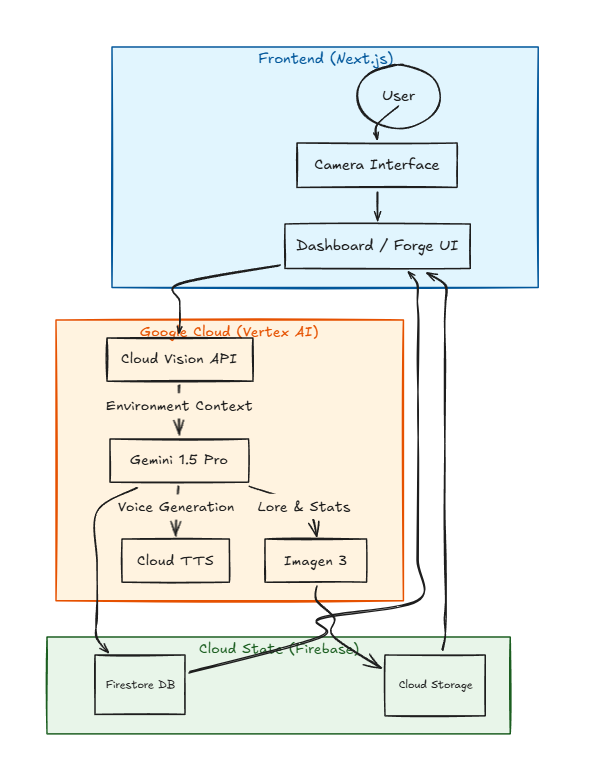

# 📸 Snappie: The Legendary Loot Forge

**Snappie** is an AI-powered RPG item generator that transforms real-world objects into unique, digital legendary loot. By combining computer vision with generative AI, Snappie turns your morning coffee, your car, or even your pet into a fully-statted RPG artifact with custom artwork and immersive lore.

---

## 🚀 Key Features

- **Snap to Forge**: Capture any real-world object using your camera.
- **AI Lore Generation**: Gemini 1.5 analyzes the context to craft unique item names, backstories, and RPG stats.
- **Visual Alchemy**: Imagen 3 generates high-quality, stylized icons based on your photo.
- **Immersive Narrator**: Google Cloud TTS brings your item's description to life with professional-grade voice synthesis.
- **Lootsaver**: Securely store your forged items in a personal collection powered by Firebase.

---

## 🏗️ High-Level Architecture

The "Snap-to-Loot" pipeline uses a multi-stage AI orchestration pattern:

1.  **Vision Phase**: Cloud Vision analyzes the raw image for labels and dominant features.
2.  **Cognition Phase**: Gemini 1.5 processes vision data to generate structured RPG metadata (Stats, Rarity, Lore).
3.  **Synthesis Phase**: Imagen 3 creates a stylized square icon representing the item.
4.  **Audio Phase**: Cloud TTS generates a voiceover for the item's flavor text.
5.  **Persistence**: All assets (images in Storage) and metadata (Firestore) are saved to the cloud.

### Architecture Diagram




---

## 🛠️ Technology Stack

- **Framework**: [Next.js 15+](https://nextjs.org/) (App Router, TypeScript)
- **Styling**: [Tailwind CSS](https://tailwindcss.com/)
- **Auth & Database**: [Firebase](https://firebase.google.com/) (Auth, Firestore, Hosting)
- **AI/ML**: [Google Cloud Vertex AI](https://cloud.google.com/vertex-ai)
  - Vision API
  - Gemini 1.5 Pro / Flash
  - Imagen 3
  - Text-to-Speech API
- **Deployment**: [Firebase App Hosting](https://firebase.google.com/docs/app-hosting)

---

## 🚦 Getting Started

### Prerequisites

- Node.js 18+
- A Google Cloud Project with Vertex AI enabled.
- A Firebase Project.

### Installation

1.  **Clone the repo**:
    ```bash
    git clone https://github.com/your-username/snappie.git
    cd snappie
    ```

2.  **Setup Environment Variables**:
    Create a `frontend/.env.local` file with your Firebase and GCP credentials. See `.env.local.example` for reference.

3.  **Install dependencies**:
    ```bash
    cd frontend
    npm install
    ```

4.  **Run locally**:
    ```bash
    npm run dev
    ```

---

## 📜 License

MIT License - Copyright (c) 2024 Snappie Team
